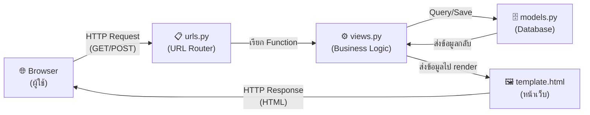
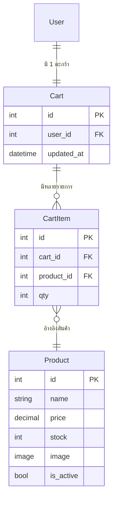
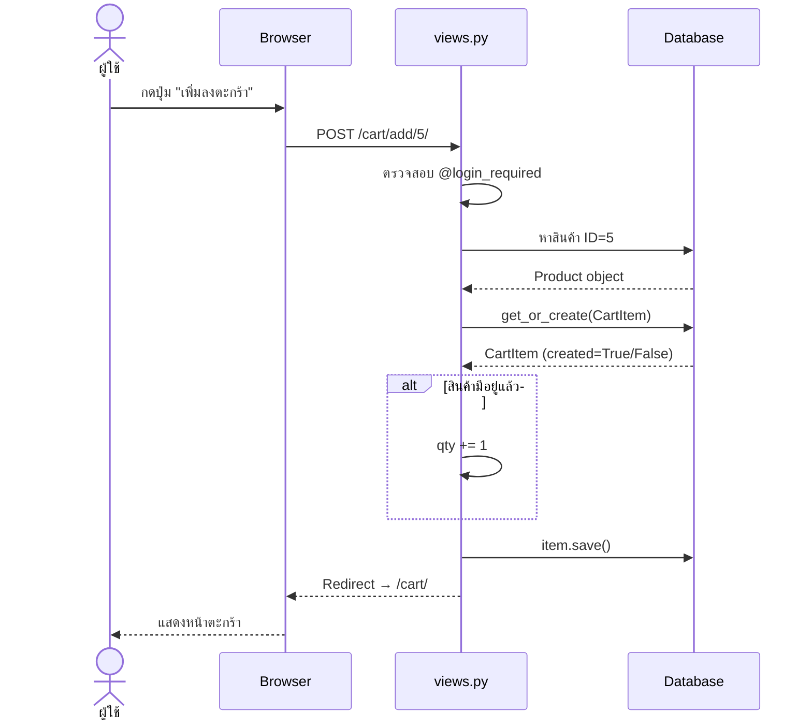
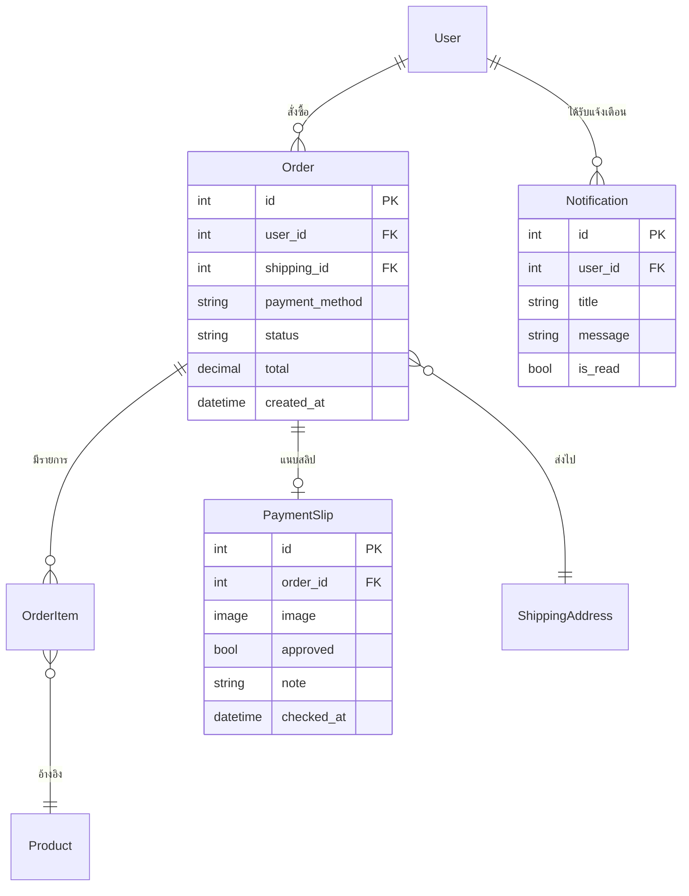
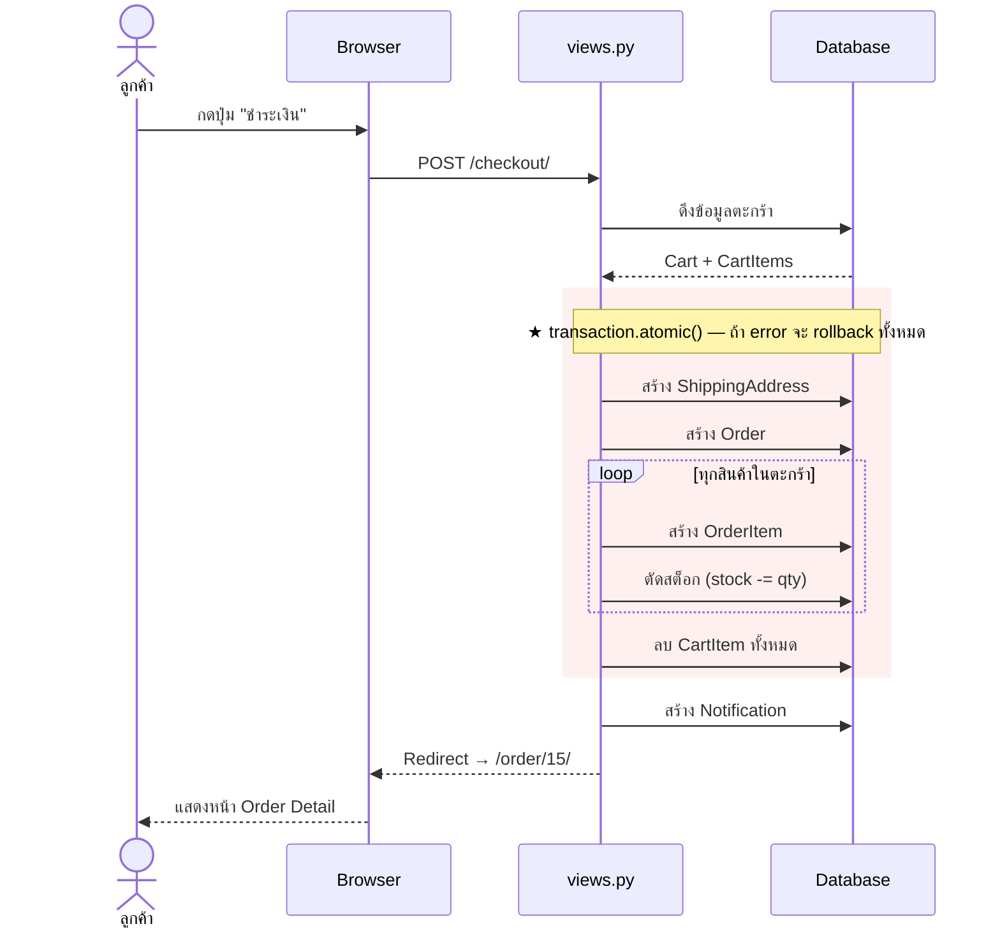
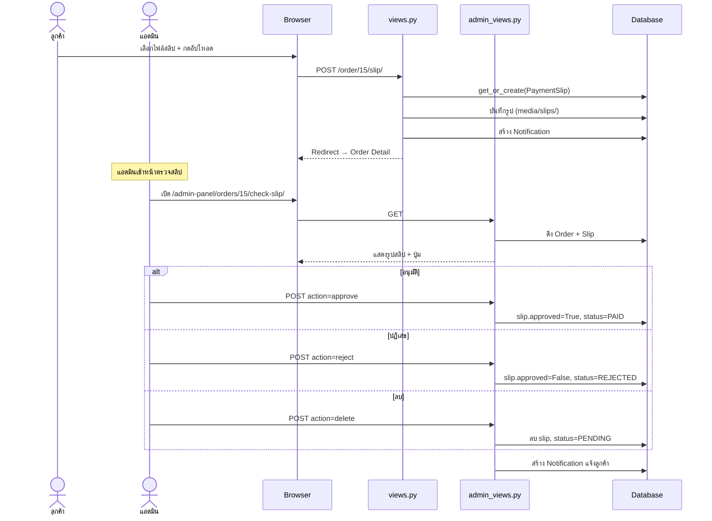

# คำอธิบายการทำงานระบบตะกร้าสินค้าและการชำระเงิน (ฉบับเต็ม)

---

## 1. สถาปัตยกรรมระบบ (MVT Pattern)

ระบบพัฒนาด้วย **Django (Python)** ใช้รูปแบบ **MVT (Model-View-Template)**:



| ชั้น | หน้าที่ | ไฟล์ |
|------|---------|------|
| **Model** | กำหนดโครงสร้างตารางในฐานข้อมูล | `models.py` |
| **View** | รับ Request → ประมวลผล → ส่ง Response | `views.py` |
| **Template** | แสดงผล HTML + ข้อมูลจาก View | `*.html` |
| **URL** | จับคู่ URL path กับ View function | `urls.py` |

---

## 2. ระบบตะกร้าสินค้า (Cart System)

### 2.1 โครงสร้างข้อมูล (Models)

**ไฟล์:** [shop/models.py](file:///d:/miniProject_Django-main/miniProject_Django-main/shop/models.py)

```python
# ตารางสินค้า
class Product(models.Model):
    name = models.CharField(max_length=255)          # ชื่อสินค้า (ข้อความ สูงสุด 255 ตัวอักษร)
    price = models.DecimalField(max_digits=10,        # ราคา (ทศนิยม 2 ตำแหน่ง)
                                decimal_places=2)
    stock = models.PositiveIntegerField(default=0)    # จำนวนสต็อก (จำนวนเต็มบวก)
    image = models.ImageField(upload_to="products/",  # รูปสินค้า (เก็บในโฟลเดอร์ media/products/)
                              null=True, blank=True)
    is_active = models.BooleanField(default=True)     # เปิด/ปิดการขาย

# ตารางตะกร้า — ผู้ใช้ 1 คน มี 1 ตะกร้า (OneToOne)
class Cart(models.Model):
    user = models.OneToOneField(User, on_delete=models.CASCADE)
    #   OneToOneField = ความสัมพันธ์ 1:1
    #   on_delete=CASCADE = ถ้าลบ User → ลบ Cart ด้วย
    updated_at = models.DateTimeField(auto_now=True)  # อัปเดตอัตโนมัติเมื่อมีการเปลี่ยนแปลง

    def total_price(self):
        # คำนวณราคารวมทั้งตะกร้า = ผลรวมของ subtotal ทุกรายการ
        return sum([item.subtotal() for item in self.items.select_related("product")])

# ตารางรายการในตะกร้า — ตะกร้า 1 ใบ มีได้หลายรายการ (ForeignKey = 1:N)
class CartItem(models.Model):
    cart = models.ForeignKey(Cart, related_name="items", on_delete=models.CASCADE)
    #   related_name="items" → เข้าถึงได้ด้วย cart.items.all()
    product = models.ForeignKey(Product, on_delete=models.CASCADE)
    qty = models.PositiveIntegerField(default=1)      # จำนวนสินค้า

    class Meta:
        unique_together = ("cart", "product")
        # ป้องกันสินค้าซ้ำในตะกร้าเดียวกัน (ถ้าเพิ่มซ้ำ → เพิ่ม qty แทน)

    def subtotal(self):
        return self.product.price * self.qty  # ราคารวมต่อรายการ = ราคา × จำนวน
```

**ER Diagram:**


### 2.2 URL Routing (เส้นทาง)

**ไฟล์:** [shop/urls.py](file:///d:/miniProject_Django-main/miniProject_Django-main/shop/urls.py)

| URL | Method | View Function | หน้าที่ |
|-----|--------|--------------|---------|
| `/` | GET | `home` | หน้าแรก แสดงสินค้าทั้งหมด |
| `/product/<id>/` | GET | `product_detail` | หน้ารายละเอียดสินค้า |
| `/cart/` | GET | `cart_detail` | แสดงตะกร้าสินค้า |
| `/cart/add/<product_id>/` | POST | `cart_add` | เพิ่มสินค้าลงตะกร้า |
| `/cart/update/<item_id>/` | POST | `cart_update_qty` | อัปเดตจำนวนสินค้า |
| `/cart/remove/<item_id>/` | GET | `cart_remove` | ลบสินค้าออกจากตะกร้า |

### 2.3 View Functions (โค้ดจริง + คำอธิบาย)

**ไฟล์:** [shop/views.py](file:///d:/miniProject_Django-main/miniProject_Django-main/shop/views.py)

#### ฟังก์ชันช่วย: ดึงตะกร้าของผู้ใช้
```python
def _get_cart(user):
    cart, _ = Cart.objects.get_or_create(user=user)
    # get_or_create() → ถ้ามี Cart อยู่แล้ว → ดึงมาใช้
    #                   → ถ้ายังไม่มี → สร้างใหม่อัตโนมัติ
    return cart
```

#### เพิ่มสินค้าลงตะกร้า (`cart_add`)
```python
@login_required  # ← บังคับให้ Login ก่อน ถ้ายังไม่ Login จะ redirect ไปหน้า Login
def cart_add(request, product_id):
    product = get_object_or_404(Product, id=product_id, is_active=True)
    #   get_object_or_404() → หาสินค้าจาก ID
    #   ถ้าไม่เจอ → แสดงหน้า 404 (Not Found)
    #   is_active=True → เอาเฉพาะสินค้าที่ยังเปิดขายอยู่

    cart = _get_cart(request.user)

    item, created = CartItem.objects.get_or_create(cart=cart, product=product)
    #   created=True  → สินค้านี้ยังไม่เคยอยู่ในตะกร้า (สร้างใหม่ qty=1)
    #   created=False → สินค้านี้มีอยู่แล้ว → เพิ่มจำนวน
    if not created:
        item.qty += 1

    if item.qty > product.stock:   # ป้องกันจำนวนเกินสต็อก
        item.qty = product.stock
        messages.error(request, "จำนวนเกินสต็อก")

    item.save()                    # บันทึกลงฐานข้อมูล
    return redirect("cart_detail") # กลับไปหน้าตะกร้า
```

#### อัปเดตจำนวนสินค้า (`cart_update_qty`)
```python
@login_required
def cart_update_qty(request, item_id):
    item = get_object_or_404(CartItem, id=item_id, cart__user=request.user)
    #   cart__user=request.user → ตรวจสอบว่าเป็นเจ้าของตะกร้าจริง (Security)
    #   "__" คือ Django Lookup → ข้ามความสัมพันธ์ (CartItem → Cart → User)

    qty_str = request.POST.get("qty", "1")  # รับค่าจาก form
    try:
        qty = int(qty_str)
    except:
        qty = 1

    if qty < 1:                    # ป้องกันค่าติดลบ
        qty = 1
    if qty > item.product.stock:   # ป้องกันเกินสต็อก
        qty = item.product.stock
        messages.error(request, "จำนวนเกินสต็อก")

    item.qty = qty
    item.save()
    return redirect("cart_detail")
```

#### ลบสินค้าจากตะกร้า (`cart_remove`)
```python
@login_required
def cart_remove(request, item_id):
    item = get_object_or_404(CartItem, id=item_id, cart__user=request.user)
    #   ตรวจสอบสิทธิ์เจ้าของก่อนลบ
    item.delete()                  # ลบออกจากฐานข้อมูล
    return redirect("cart_detail")
```

### 2.4 Sequence Diagram — เพิ่มสินค้าลงตะกร้า



---

## 3. ระบบการชำระเงิน (Payment System)

### 3.1 โครงสร้างข้อมูล (Models)

**ไฟล์:** [orders/models.py](file:///d:/miniProject_Django-main/miniProject_Django-main/orders/models.py)

```python
# ตัวเลือกวิธีชำระเงิน (TextChoices = Enum)
class PaymentMethod(models.TextChoices):
    COD = "COD", "เก็บเงินปลายทาง"          # ชำระเงินตอนรับของ
    TRANSFER = "TRANSFER", "โอนเงิน"         # โอนเงินผ่านธนาคาร
    ONLINE = "ONLINE", "ชำระเงินผ่าน QR Code" # สแกน QR PromptPay

# สถานะของคำสั่งซื้อ
class OrderStatus(models.TextChoices):
    PENDING = "PENDING"       # รอชำระเงิน / รอตรวจสอบ
    PAID = "PAID"             # ชำระแล้ว (แอดมินอนุมัติสลิป)
    REJECTED = "REJECTED"     # สลิปไม่ถูกต้อง
    SHIPPED = "SHIPPED"       # จัดส่งแล้ว
    COMPLETED = "COMPLETED"   # สำเร็จ
    CANCELLED = "CANCELLED"   # ยกเลิก

# ที่อยู่จัดส่ง
class ShippingAddress(models.Model):
    user = models.ForeignKey(User, on_delete=models.CASCADE)
    full_name = models.CharField(max_length=255)    # ชื่อผู้รับ
    phone = models.CharField(max_length=30)         # เบอร์โทร
    address_line = models.TextField()               # ที่อยู่
    created_at = models.DateTimeField(auto_now_add=True)

# คำสั่งซื้อ
class Order(models.Model):
    user = models.ForeignKey(User, on_delete=models.CASCADE)
    shipping = models.ForeignKey(ShippingAddress, on_delete=models.PROTECT)
    #   PROTECT = ป้องกันไม่ให้ลบที่อยู่ถ้ายังมี Order อ้างอิงอยู่
    payment_method = models.CharField(max_length=20, choices=PaymentMethod.choices)
    status = models.CharField(max_length=20, choices=OrderStatus.choices,
                              default=OrderStatus.PENDING)
    total = models.DecimalField(max_digits=12, decimal_places=2, default=0)
    created_at = models.DateTimeField(auto_now_add=True)  # วันที่สร้าง (อัตโนมัติ)

# รายการสินค้าในออเดอร์
class OrderItem(models.Model):
    order = models.ForeignKey(Order, related_name="items", on_delete=models.CASCADE)
    product = models.ForeignKey(Product, on_delete=models.PROTECT)
    price = models.DecimalField(max_digits=10, decimal_places=2)
    #   เก็บราคาแยกไว้ ← เพราะราคาสินค้าอาจเปลี่ยนในอนาคต
    qty = models.PositiveIntegerField()

    def subtotal(self):
        return self.price * self.qty

# สลิปการชำระเงิน
class PaymentSlip(models.Model):
    order = models.OneToOneField(Order, on_delete=models.CASCADE, related_name="slip")
    #   OneToOne = 1 ออเดอร์ มี 1 สลิปเท่านั้น
    image = models.ImageField(upload_to="slips/")    # รูปสลิป (media/slips/)
    approved = models.BooleanField(null=True, blank=True)
    #   None = ยังไม่ตรวจ | True = ผ่าน | False = ไม่ผ่าน
    note = models.TextField(blank=True, default="")  # หมายเหตุจากแอดมิน
    checked_at = models.DateTimeField(null=True, blank=True)

# การแจ้งเตือน
class Notification(models.Model):
    user = models.ForeignKey(User, on_delete=models.CASCADE)
    title = models.CharField(max_length=255)
    message = models.TextField()
    created_at = models.DateTimeField(auto_now_add=True)
    is_read = models.BooleanField(default=False)     # อ่านแล้ว/ยังไม่อ่าน
```

**ER Diagram:**


### 3.2 URL Routing (เส้นทาง)

**ไฟล์:** [orders/urls.py](file:///d:/miniProject_Django-main/miniProject_Django-main/orders/urls.py)

| URL | Method | View | หน้าที่ |
|-----|--------|------|---------|
| `/checkout/` | GET/POST | `checkout` | หน้าชำระเงิน + สร้าง Order |
| `/order/<id>/` | GET | `order_detail` | รายละเอียดออเดอร์ |
| `/order/<id>/slip/` | POST | `upload_slip` | อัปโหลดสลิป |
| `/order/<id>/slip/remove/` | POST | `remove_slip` | ลบสลิป (ฝั่งลูกค้า) |
| `/admin-panel/orders/` | GET | `admin_orders` | รายการออเดอร์ (Admin) |
| `/admin-panel/orders/<id>/check-slip/` | GET/POST | `admin_check_slip` | ตรวจสลิป (Admin) |
| `/admin-panel/orders/<id>/delete/` | POST | `admin_delete_order` | ลบออเดอร์ (Admin) |

### 3.3 View Functions (โค้ดจริง + คำอธิบาย)

**ไฟล์:** [orders/views.py](file:///d:/miniProject_Django-main/miniProject_Django-main/orders/views.py)

#### Checkout — สร้างคำสั่งซื้อ
```python
@login_required
def checkout(request):
    cart = Cart.objects.get(user=request.user)
    if cart.items.count() == 0:            # ตะกร้าว่าง → ไม่ให้ชำระ
        messages.error(request, "ตะกร้าว่าง")
        return redirect("cart_detail")

    if request.method == "POST":
        # 1. รับข้อมูลจาก form
        full_name = request.POST.get("full_name", "").strip()
        phone = request.POST.get("phone", "").strip()
        address_line = request.POST.get("address_line", "").strip()
        payment_method = request.POST.get("payment_method")

        # 2. Validate ข้อมูล
        if not full_name or not phone or not address_line:
            messages.error(request, "กรอกข้อมูลจัดส่งให้ครบ")
            return redirect("checkout")

        try:
            # 3. ★★★ transaction.atomic() ★★★
            #    = ทำทุกอย่างในก้อนเดียว ถ้า error → ยกเลิกทั้งหมด (rollback)
            with transaction.atomic():
                # 3.1 สร้างที่อยู่จัดส่ง
                shipping = ShippingAddress.objects.create(
                    user=request.user, full_name=full_name,
                    phone=phone, address_line=address_line
                )
                # 3.2 สร้าง Order
                order = Order.objects.create(
                    user=request.user, shipping=shipping,
                    payment_method=payment_method,
                    status=OrderStatus.PENDING,
                    total=cart.total_price()
                )
                # 3.3 ย้ายของจากตะกร้า → OrderItem + ตัดสต็อก
                for ci in cart.items.select_related("product"):
                    if ci.qty > ci.product.stock:
                        raise ValueError(f"สินค้า {ci.product.name} สต็อกไม่พอ")

                    OrderItem.objects.create(
                        order=order, product=ci.product,
                        price=ci.product.price, qty=ci.qty
                    )
                    ci.product.stock -= ci.qty   # ★ ตัดสต็อก
                    ci.product.save()

                # 3.4 เคลียร์ตะกร้า
                cart.items.all().delete()

            # 4. แจ้งเตือนลูกค้า
            Notification.objects.create(
                user=request.user,
                title="สร้างคำสั่งซื้อสำเร็จ",
                message=f"คำสั่งซื้อ #{order.id} ถูกสร้างแล้ว"
            )
            return redirect("order_detail", order_id=order.id)

        except Exception as e:
            messages.error(request, f"ไม่สามารถสร้างคำสั่งซื้อได้: {e}")
            return redirect("checkout")

    return render(request, "orders/checkout.html", {...})
```

#### Order Detail — แสดงรายละเอียด + QR Code
```python
@login_required
def order_detail(request, order_id):
    order = get_object_or_404(Order, id=order_id, user=request.user)
    #   user=request.user → ลูกค้าเห็นแค่ออเดอร์ของตัวเอง (Security)

    qr_code_img = None
    # ★ สร้าง QR Code เฉพาะกรณี: วิธีชำระ = QR Code + สถานะ = PENDING
    if order.status == OrderStatus.PENDING and order.payment_method == PaymentMethod.ONLINE:
        from promptpay import qrcode as pp_qrcode  # สร้าง PromptPay payload
        import qrcode, base64
        from io import BytesIO

        payload = pp_qrcode.generate_payload(settings.PROMPTPAY_ID, float(order.total))
        #   สร้างข้อมูล PromptPay (เบอร์โทร/บัตรปชช. + ยอดเงิน)
        img = qrcode.make(payload)            # สร้างรูป QR Code จาก payload
        buffer = BytesIO()
        img.save(buffer, format="PNG")
        qr_code_img = base64.b64encode(buffer.getvalue()).decode()
        #   แปลงรูปเป็น Base64 → แสดงใน HTML ได้เลย

    return render(request, "orders/order_detail.html", {
        "order": order, "qr_code_img": qr_code_img, ...
    })
```

#### Upload Slip — อัปโหลดสลิป
```python
@login_required
def upload_slip(request, order_id):
    order = get_object_or_404(Order, id=order_id, user=request.user)

    # ตรวจสอบว่าวิธีชำระต้องอัปโหลดสลิป
    if order.payment_method not in [PaymentMethod.TRANSFER, PaymentMethod.ONLINE]:
        messages.error(request, "ออเดอร์นี้ไม่ต้องอัปโหลดสลิป")
        return redirect("order_detail", order_id=order.id)

    if request.method == "POST":
        img = request.FILES.get("slip")  # รับไฟล์รูปจาก form
        if not img:
            messages.error(request, "กรุณาเลือกไฟล์รูปสลิป")
            return redirect("upload_slip", order_id=order.id)

        slip, _ = PaymentSlip.objects.get_or_create(order=order)
        #   get_or_create → ถ้ามีสลิปเดิม → อัปเดต (ไม่สร้างซ้ำ)
        slip.image = img
        slip.approved = None      # รีเซ็ตสถานะ → รอตรวจใหม่
        slip.note = ""
        slip.checked_at = None
        slip.save()               # บันทึกรูปลง media/slips/

        Notification.objects.create(...)
        return redirect("order_detail", order_id=order.id)
```

#### Remove Slip — ลบสลิป (ฝั่งลูกค้า)
```python
@login_required
def remove_slip(request, order_id):
    order = get_object_or_404(Order, id=order_id, user=request.user)

    if request.method == "POST":
        if hasattr(order, 'slip'):     # ตรวจว่ามีสลิปอยู่หรือไม่
            order.slip.delete()        # ลบสลิปออก
            if order.status == OrderStatus.REJECTED:
                order.status = OrderStatus.PENDING  # รีเซ็ตสถานะ
                order.save()
            messages.success(request, "ลบสลิปเรียบร้อยแล้ว")
    return redirect("order_detail", order_id=order.id)
```

### 3.4 Admin Views (โค้ดจริง + คำอธิบาย)

**ไฟล์:** [orders/admin_views.py](file:///d:/miniProject_Django-main/miniProject_Django-main/orders/admin_views.py)

#### ตรวจสอบสลิป (`admin_check_slip`)
```python
@staff_member_required  # ★ เฉพาะ Admin (is_staff=True) เท่านั้น
def admin_check_slip(request, order_id):
    order = get_object_or_404(Order, id=order_id)
    slip = getattr(order, "slip", None)  # ดึงสลิป (ถ้ามี)

    if request.method == "POST":
        if not slip:
            return redirect("admin_orders")

        action = request.POST.get("action")  # รับ action จากปุ่มที่กด

        if action == "approve":              # ★ อนุมัติ
            slip.approved = True
            order.status = OrderStatus.PAID

        elif action == "reject":             # ★ ปฏิเสธ
            slip.approved = False
            order.status = OrderStatus.REJECTED

        elif action == "delete":             # ★ ลบสลิป
            slip.delete()
            order.status = OrderStatus.PENDING
            order.save()
            Notification.objects.create(...)
            return redirect("admin_orders")  # ← return ก่อน เพราะ slip ถูกลบแล้ว

        slip.save()
        order.save()
        Notification.objects.create(...)     # แจ้งเตือนลูกค้า
        return redirect("admin_orders")
```

#### ลบคำสั่งซื้อ (`admin_delete_order`)
```python
@staff_member_required
def admin_delete_order(request, order_id):
    order = get_object_or_404(Order, id=order_id)

    if request.method == "POST":
        # ★ คืนสต็อกก่อนลบ (สำคัญมาก!)
        for item in order.items.select_related("product"):
            item.product.stock += item.qty   # คืนสต็อกกลับ
            item.product.save()

        order_num = order.id
        user = order.user
        order.delete()
        #   CASCADE → ลบ OrderItem + PaymentSlip อัตโนมัติ

        Notification.objects.create(
            user=user,
            title="คำสั่งซื้อถูกลบ",
            message=f"คำสั่งซื้อ #{order_num} ถูกลบโดยแอดมิน"
        )
    return redirect("admin_orders")
```

### 3.5 Sequence Diagram — กระบวนการ Checkout



### 3.6 Sequence Diagram — อัปโหลดสลิปและตรวจสอบ



---

## 4. ระบบ Notification (การแจ้งเตือน)

ระบบแจ้งเตือนจะสร้าง **Notification** อัตโนมัติเมื่อเกิดเหตุการณ์สำคัญ:

| เหตุการณ์ | ข้อความ | สร้างโดย |
|-----------|---------|---------|
| สร้างคำสั่งซื้อสำเร็จ | "คำสั่งซื้อ #15 ถูกสร้างแล้ว" | `checkout()` |
| อัปโหลดสลิปสำเร็จ | "ระบบได้รับสลิป...กำลังรอตรวจสอบ" | `upload_slip()` |
| แอดมินอนุมัติ/ปฏิเสธสลิป | "สลิปผ่าน/ไม่ผ่านการตรวจสอบ" | `admin_check_slip()` |
| แอดมินลบสลิป | "สลิปถูกลบโดยแอดมิน" | `admin_check_slip()` |
| แอดมินลบออเดอร์ | "คำสั่งซื้อถูกลบโดยแอดมิน" | `admin_delete_order()` |

---

## 5. ระบบ Security (การรักษาความปลอดภัย)

| กลไก | วิธีการ | ป้องกันอะไร |
|------|---------|------------|
| `@login_required` | บังคับ Login ก่อนเข้าถึง View | ผู้ไม่ได้ Login เข้าถึงข้อมูล |
| `@staff_member_required` | เฉพาะ Admin เท่านั้น | ผู้ใช้ทั่วไปเข้าถึง Admin Panel |
| `` | สร้าง Token ในทุก Form | Cross-Site Request Forgery (CSRF) |
| `cart__user=request.user` | ตรวจสอบเจ้าของข้อมูล | ผู้ใช้แก้ไขตะกร้าของคนอื่น |
| `get_object_or_404()` | แสดง 404 ถ้าไม่พบข้อมูล | Error จากการเข้าถึง ID ที่ไม่มีอยู่ |
| `transaction.atomic()` | Rollback ถ้ามี Error | ข้อมูลค้างผิดพลาดในฐานข้อมูล |

---

## 6. คำถามที่อาจารย์อาจถาม (พร้อมคำตอบ)

**Q1: ทำไมต้องใช้ `transaction.atomic()` ตอนสร้าง Order?**
> เพราะกระบวนการมีหลายขั้นตอน: สร้างที่อยู่ → สร้าง Order → ย้ายของจากตะกร้า → ตัดสต็อก → ลบตะกร้า ถ้ามี error ระหว่างทาง (เช่น สต็อกไม่พอ) ระบบจะ **rollback ทุกอย่าง** กลับไปเหมือนเดิมครับ

**Q2: ทำไมใช้ OneToOneField ระหว่าง Order กับ PaymentSlip?**
> เพราะ 1 ออเดอร์ มีสลิปได้แค่ 1 ใบครับ ถ้าอัปโหลดใหม่ ระบบจะอัปเดตสลิปเดิม (ใช้ `get_or_create()`)

**Q3: ทำไม Cart ใช้ OneToOne กับ User?**
> เพราะผู้ใช้ 1 คน มีตะกร้า 1 ใบ ทำให้ไม่ต้องจัดการหลายตะกร้า และเข้าถึงง่ายครับ

**Q4: ลบ Order แล้วทำไมต้องคืนสต็อก?**
> เพราะตอนสร้าง Order ระบบตัดสต็อกไปแล้ว (`stock -= qty`) ถ้าลบ Order โดยไม่คืนสต็อก จำนวนสินค้าจะหายไปจากระบบครับ

**Q5: QR Code สร้างยังไง?**
> ใช้ library `promptpay` สร้าง Payload (เลขบัญชี + ยอดเงิน) → library `qrcode` แปลงเป็นรูป QR → แปลงเป็น Base64 string → แสดงใน `` tag ครับ

**Q6: CSRF Token คืออะไร? ทำไมต้องใส่?**
> CSRF Token เป็นกลไกป้องกันการโจมตีแบบ Cross-Site Request Forgery คือป้องกันไม่ให้เว็บอื่นส่ง Form มาหลอกระบบของเราครับ Django บังคับใส่ `` ในทุก `<form method="POST">`

**Q7: `get_or_create()` ทำงานยังไง?**
> ค้นหาข้อมูลในฐานข้อมูลก่อน ถ้าเจอ → ใช้ตัวที่มีอยู่ ถ้าไม่เจอ → สร้างใหม่ ประโยชน์คือไม่ต้องเช็ค if/else เองครับ คืนค่า `(object, created)` โดย `created=True` ถ้าสร้างใหม่

**Q8: `on_delete=CASCADE` vs `PROTECT` ต่างกันยังไง?**
> - `CASCADE` = ถ้าลบต้นทาง → ลบปลายทางด้วย (เช่น ลบ User → ลบ Cart อัตโนมัติ)
> - `PROTECT` = ป้องกันไม่ให้ลบต้นทาง ถ้ายังมีปลายทางอ้างอิงอยู่ (เช่น ไม่ให้ลบ Product ถ้ายังมี OrderItem อ้างอิง)

**Q9: `related_name` คืออะไร?**
> เป็นชื่อที่ใช้เข้าถึงข้อมูลย้อนกลับครับ เช่น `Cart` มี `CartItem` เป็น ForeignKey ถ้าตั้ง `related_name="items"` จะเข้าถึงได้ด้วย `cart.items.all()` แทนที่จะเขียน `CartItem.objects.filter(cart=cart)`

**Q10: ทำไม OrderItem ถึงเก็บ price แยก ไม่ดึงจาก Product โดยตรง?**
> เพราะราคาสินค้าอาจเปลี่ยนในอนาคตครับ ถ้าดึงจาก Product โดยตรง ราคาในออเดอร์เก่าจะเปลี่ยนตาม ซึ่งไม่ถูกต้อง

---

## 7. สรุปไฟล์ทั้งหมด

### ระบบตะกร้า (`shop/`)
| ไฟล์ | หน้าที่ |
|------|---------|
| [shop/models.py](file:///d:/miniProject_Django-main/miniProject_Django-main/shop/models.py) | Product, Cart, CartItem |
| [shop/views.py](file:///d:/miniProject_Django-main/miniProject_Django-main/shop/views.py) | cart_add, cart_detail, cart_update_qty, cart_remove |
| [shop/urls.py](file:///d:/miniProject_Django-main/miniProject_Django-main/shop/urls.py) | URL routing ตะกร้า |
| [cart.html](file:///d:/miniProject_Django-main/miniProject_Django-main/shop/templates/shop/cart.html) | Template แสดงตะกร้า |

### ระบบชำระเงิน (`orders/`)
| ไฟล์ | หน้าที่ |
|------|---------|
| [orders/models.py](file:///d:/miniProject_Django-main/miniProject_Django-main/orders/models.py) | Order, OrderItem, PaymentSlip, Notification |
| [orders/views.py](file:///d:/miniProject_Django-main/miniProject_Django-main/orders/views.py) | checkout, order_detail, upload_slip, remove_slip |
| [orders/admin_views.py](file:///d:/miniProject_Django-main/miniProject_Django-main/orders/admin_views.py) | admin_orders, admin_check_slip, admin_delete_order |
| [orders/urls.py](file:///d:/miniProject_Django-main/miniProject_Django-main/orders/urls.py) | URL routing ออเดอร์ |
